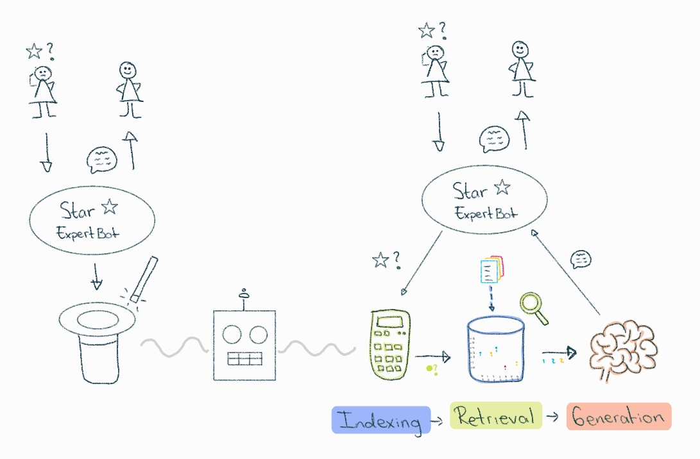
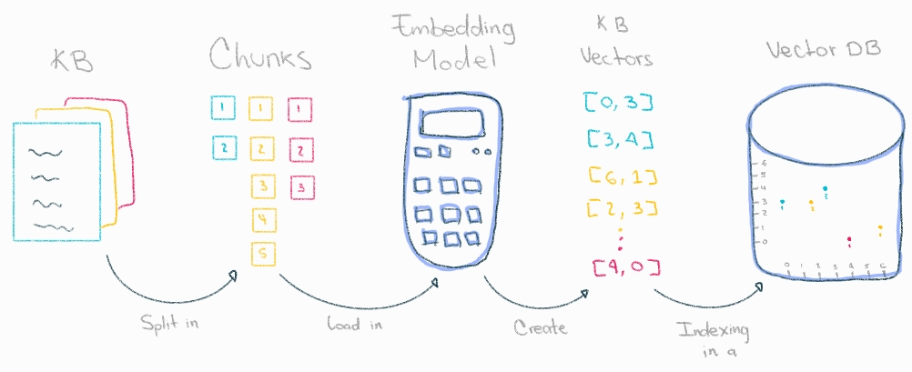
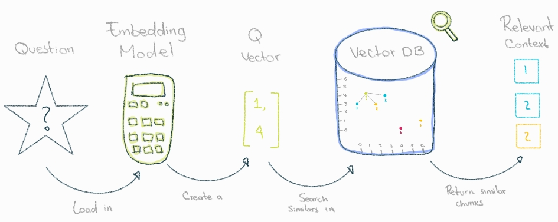
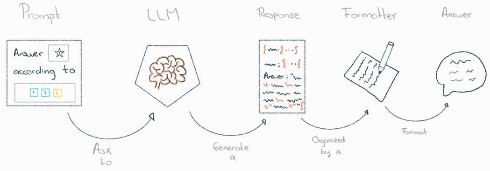

# Basic Structure

The most basic version of this technique has the followign components:

1. **Indexing:** Load the new knowledgebase in order to make easier find specific content in its content.
2. **Retrieval:** Retrieve relevant information from the new knowledgebase gave a question.
3. **Generation:** Generate the answer using the retrieved information.

## Indexing

To facilitate efficient retrieving, we need to convert the content in a numerical representation and store them into a persistent component like a database.

The numerical representions use to be vectors embeddings. Those vectors allows us represent the relationships that words have between each others, for example, the semantic relationship between cat, pet, and animal.

To convert the content into vector embeddings, we need to use embedding models, but we first need to split the content in chunks because the embedding models doesn't have a limited context window.

In summary the Indexing process involves:

1. Loading the content form a external source like a url, local files, third party APIs responses, etc.
2. Splitting the content into smaller chunks
3. Creating vector embeddings for each chunk.
4. The vectorized content in a vector store for later searching.

## 2. Retrieval

To retrieve relevant information to answer the question, we need to:

1. Convert the question into an embedding vector using the embedding model.
2. Run a semantic search (find the nearest vectors in the vector store to the question vector).
3. Get the chunks of content attached to the search result vectors. accurate

## Generation

We have to pass the chunks of content into a LLM to write the answer of the question. That involves:

1. Define the prompt template we to sent to the LLM. For example: Define this answer: `answer` according to these `chunks of content`.
2. Parsing the LLM response and format the answer.

---

## Framework Tutorials

- [LangChain](langchain/README.md)
